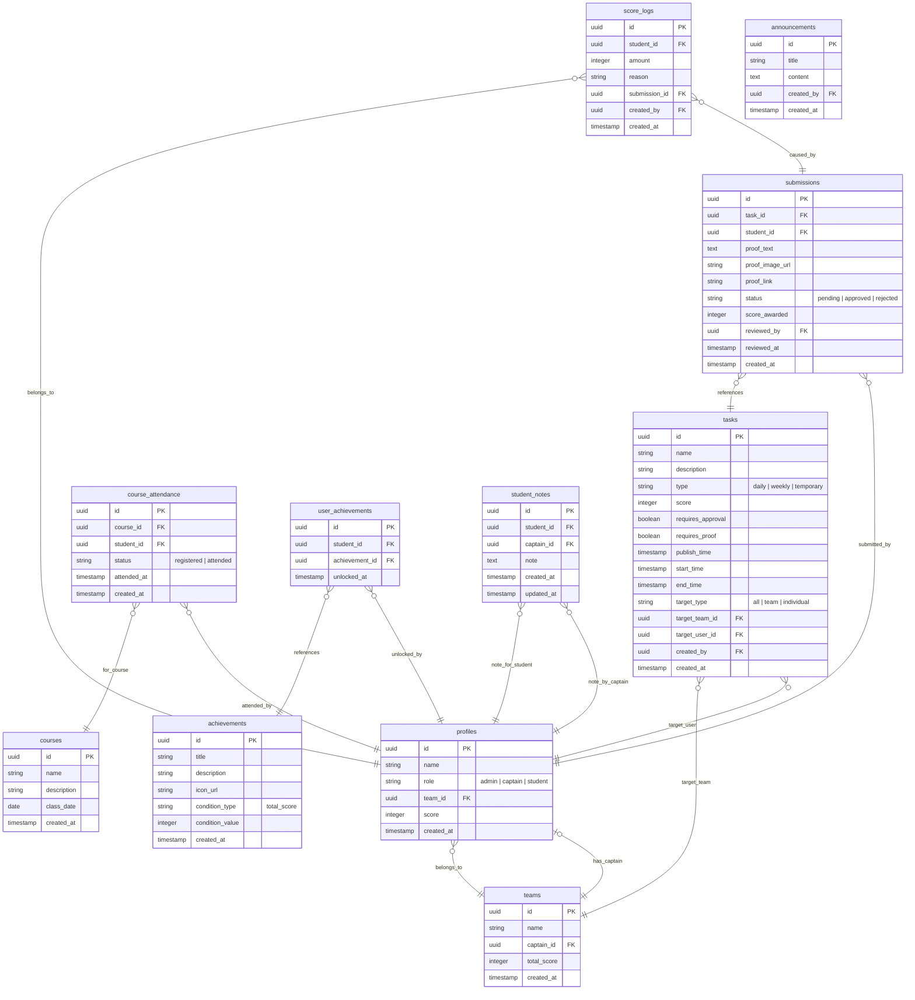

# NLP 人性溝通術課程計分系統 - 系統架構設計書 (Arch.md)

本文件說明「NLP人性溝通術課程計分系統」的核心架構設計，包含角色權限、資料庫關聯表結構、Row Level Security (RLS) 權限設計、自動化 Trigger 邏輯以及前端頁面與九大功能頁籤 (Tabs) 架構。

---

## 1. 系統角色與權限矩陣 (Roles & Permissions)

本系統支援三種角色，其權限範圍如下：

| 功能模組 | 管理員 (Admin) | 小隊長 (Captain) | 學員 (Student) |
| :--- | :---: | :---: | :---: |
| **修行定課** | 設定/發布每日定課任務 | 僅查看自己與隊員狀態 | 每日定課打卡、查看自己狀態 |
| **任務中心** | 發布/管理/審核每週主線任務與證明 | 僅查看小隊組員提交狀態 | 提交每週主線任務證明 (文字、圖片、連結) |
| **特殊任務** | 發布/管理臨時或活動加分任務 | 僅查看 | 參與打卡或提交證明 |
| **修為榜** | 手動調整分數、查看所有排行與積分 | 查看自己小隊總分、排行與組員狀態 | 查看個人積分、自己小隊排行與個人紀錄 |
| **成就系統** | 建立成就徽章、設定解鎖門檻 | 僅查看解鎖狀態 | 查看個人已解鎖與未解鎖之成就 |
| **課程系統** | 建立課程、設定簽到、授權掃碼 | 執行簽到掃碼、檢視隊員出席 | 課程報名、展示簽到 QR Code |
| **明細系統** | 查看所有分數異動流水帳 | 查看組員分數異動流水帳 | 僅查看自己分數異動流水帳 |
| **指揮所** | 管理所有小隊、指派隊長與學員 | 檢視隊員每日/每週完成矩陣、編輯組員輔導備註 | 無權限 |
| **指揮部** | 任務管理/審核/小隊分配/調整/公告發布 | 無權限 | 無權限 |

---

## 2. 資料庫結構設計 (PostgreSQL Schema)

為了支援九大功能，資料庫新增了課程 (`courses`)、簽到 (`course_attendance`)、成就 (`achievements`) 與學員解鎖成就 (`user_achievements`)。

### 資料關係圖 (ERD)



---

## 3. 資料庫 SQL 腳本與安全性設定 (PostgreSQL & RLS Policies)

請將以下 SQL 貼入 Supabase SQL 編輯器執行，以初始化所有資料表、自動加分與成就解鎖 Trigger 以及 Row Level Security (RLS) 權限原則。

```sql
-- ==========================================
-- 1. 建立基本資料表與新增模組
-- ==========================================

-- 建立小隊表
CREATE TABLE public.teams (
    id UUID PRIMARY KEY DEFAULT gen_random_uuid(),
    name TEXT NOT NULL UNIQUE,
    captain_id UUID,
    total_score INT NOT NULL DEFAULT 0,
    created_at TIMESTAMP WITH TIME ZONE DEFAULT timezone('utc'::text, now()) NOT NULL
);

-- 建立個人檔案表 (與 auth.users 連動)
CREATE TABLE public.profiles (
    id UUID PRIMARY KEY REFERENCES auth.users ON DELETE CASCADE,
    name TEXT NOT NULL,
    role TEXT NOT NULL CHECK (role IN ('admin', 'captain', 'student')),
    team_id UUID REFERENCES public.teams(id) ON DELETE SET NULL,
    score INT NOT NULL DEFAULT 0,
    created_at TIMESTAMP WITH TIME ZONE DEFAULT timezone('utc'::text, now()) NOT NULL
);

-- 為 teams 添加 captain_id 外鍵限制
ALTER TABLE public.teams 
ADD CONSTRAINT fk_teams_captain FOREIGN KEY (captain_id) REFERENCES public.profiles(id) ON DELETE SET NULL;

-- 建立任務表
CREATE TABLE public.tasks (
    id UUID PRIMARY KEY DEFAULT gen_random_uuid(),
    name TEXT NOT NULL,
    description TEXT,
    type TEXT NOT NULL CHECK (type IN ('daily', 'weekly', 'temporary')),
    score INT NOT NULL DEFAULT 0,
    requires_approval BOOLEAN NOT NULL DEFAULT true,
    requires_proof BOOLEAN NOT NULL DEFAULT true,
    publish_time TIMESTAMP WITH TIME ZONE NOT NULL,
    start_time TIMESTAMP WITH TIME ZONE NOT NULL,
    end_time TIMESTAMP WITH TIME ZONE NOT NULL,
    target_type TEXT NOT NULL CHECK (target_type IN ('all', 'team', 'individual')),
    target_team_id UUID REFERENCES public.teams(id) ON DELETE SET NULL,
    target_user_id UUID REFERENCES public.profiles(id) ON DELETE SET NULL,
    created_by UUID REFERENCES public.profiles(id) ON DELETE SET NULL,
    created_at TIMESTAMP WITH TIME ZONE DEFAULT timezone('utc'::text, now()) NOT NULL
);

-- 建立提交證明表
CREATE TABLE public.submissions (
    id UUID PRIMARY KEY DEFAULT gen_random_uuid(),
    task_id UUID REFERENCES public.tasks(id) ON DELETE CASCADE NOT NULL,
    student_id UUID REFERENCES public.profiles(id) ON DELETE CASCADE NOT NULL,
    proof_text TEXT,
    proof_image_url TEXT,
    proof_link TEXT,
    status TEXT NOT NULL CHECK (status IN ('pending', 'approved', 'rejected')) DEFAULT 'pending',
    score_awarded INT NOT NULL DEFAULT 0,
    reviewed_by UUID REFERENCES public.profiles(id) ON DELETE SET NULL,
    reviewed_at TIMESTAMP WITH TIME ZONE,
    created_at TIMESTAMP WITH TIME ZONE DEFAULT timezone('utc'::text, now()) NOT NULL
);

-- 建立積分異動日誌表
CREATE TABLE public.score_logs (
    id UUID PRIMARY KEY DEFAULT gen_random_uuid(),
    student_id UUID REFERENCES public.profiles(id) ON DELETE CASCADE NOT NULL,
    amount INT NOT NULL,
    reason TEXT NOT NULL,
    submission_id UUID REFERENCES public.submissions(id) ON DELETE SET NULL,
    created_by UUID REFERENCES public.profiles(id) ON DELETE SET NULL,
    created_at TIMESTAMP WITH TIME ZONE DEFAULT timezone('utc'::text, now()) NOT NULL
);

-- 建立課程表
CREATE TABLE public.courses (
    id UUID PRIMARY KEY DEFAULT gen_random_uuid(),
    name TEXT NOT NULL,
    description TEXT,
    class_date DATE NOT NULL,
    created_at TIMESTAMP WITH TIME ZONE DEFAULT timezone('utc'::text, now()) NOT NULL
);

-- 建立課程簽到/報名表
CREATE TABLE public.course_attendance (
    id UUID PRIMARY KEY DEFAULT gen_random_uuid(),
    course_id UUID REFERENCES public.courses(id) ON DELETE CASCADE NOT NULL,
    student_id UUID REFERENCES public.profiles(id) ON DELETE CASCADE NOT NULL,
    status TEXT CHECK (status IN ('registered', 'attended')) DEFAULT 'registered',
    attended_at TIMESTAMP WITH TIME ZONE,
    created_at TIMESTAMP WITH TIME ZONE DEFAULT timezone('utc'::text, now()) NOT NULL,
    UNIQUE(course_id, student_id)
);

-- 建立成就設定表
CREATE TABLE public.achievements (
    id UUID PRIMARY KEY DEFAULT gen_random_uuid(),
    title TEXT NOT NULL UNIQUE,
    description TEXT,
    icon_url TEXT,
    condition_type TEXT NOT NULL CHECK (condition_type IN ('total_score')),
    condition_value INT NOT NULL,
    created_at TIMESTAMP WITH TIME ZONE DEFAULT timezone('utc'::text, now()) NOT NULL
);

-- 建立學員解鎖成就表
CREATE TABLE public.user_achievements (
    id UUID PRIMARY KEY DEFAULT gen_random_uuid(),
    student_id UUID REFERENCES public.profiles(id) ON DELETE CASCADE NOT NULL,
    achievement_id UUID REFERENCES public.achievements(id) ON DELETE CASCADE NOT NULL,
    unlocked_at TIMESTAMP WITH TIME ZONE DEFAULT timezone('utc'::text, now()) NOT NULL,
    UNIQUE(student_id, achievement_id)
);

-- 建立公告表
CREATE TABLE public.announcements (
    id UUID PRIMARY KEY DEFAULT gen_random_uuid(),
    title TEXT NOT NULL,
    content TEXT NOT NULL,
    created_by UUID REFERENCES public.profiles(id) ON DELETE SET NULL,
    created_at TIMESTAMP WITH TIME ZONE DEFAULT timezone('utc'::text, now()) NOT NULL
);

-- 建立小隊長備註學員表
CREATE TABLE public.student_notes (
    id UUID PRIMARY KEY DEFAULT gen_random_uuid(),
    student_id UUID REFERENCES public.profiles(id) ON DELETE CASCADE NOT NULL,
    captain_id UUID REFERENCES public.profiles(id) ON DELETE CASCADE NOT NULL,
    note TEXT NOT NULL,
    created_at TIMESTAMP WITH TIME ZONE DEFAULT timezone('utc'::text, now()) NOT NULL,
    updated_at TIMESTAMP WITH TIME ZONE DEFAULT timezone('utc'::text, now()) NOT NULL,
    UNIQUE(student_id, captain_id)
);


-- ==========================================
-- 2. 建立自動化 Triggers 與 函數
-- ==========================================

-- A. 註冊帳號時自動在 profiles 新增對應資料
CREATE OR REPLACE FUNCTION public.handle_new_user()
RETURNS trigger AS $$
BEGIN
  INSERT INTO public.profiles (id, name, role, score)
  VALUES (
    new.id,
    COALESCE(new.raw_user_meta_data->>'name', new.email),
    COALESCE(new.raw_user_meta_data->>'role', 'student'),
    0
  );
  RETURN new;
END;
$$ LANGUAGE plpgsql SECURITY DEFINER;

CREATE OR REPLACE TRIGGER on_auth_user_created
  AFTER INSERT ON auth.users
  FOR EACH ROW EXECUTE FUNCTION public.handle_new_user();


-- B. 當提交審核通過時，自動為學員及小隊加分，並寫入分數日誌
CREATE OR REPLACE FUNCTION public.process_submission_score()
RETURNS TRIGGER AS $$
DECLARE
  v_score_to_add INT;
  v_team_id UUID;
  v_task_name TEXT;
BEGIN
  SELECT score, name INTO v_score_to_add, v_task_name FROM public.tasks WHERE id = NEW.task_id;
  SELECT team_id INTO v_team_id FROM public.profiles WHERE id = NEW.student_id;

  -- 判斷是否變更為審核通過
  IF (TG_OP = 'INSERT' AND NEW.status = 'approved') OR 
     (TG_OP = 'UPDATE' AND NEW.status = 'approved' AND OLD.status <> 'approved') THEN
     
    NEW.score_awarded := v_score_to_add;
    
    -- 更新個人分數
    UPDATE public.profiles 
    SET score = score + v_score_to_add 
    WHERE id = NEW.student_id;
    
    -- 更新小隊分數
    IF v_team_id IS NOT NULL THEN
      UPDATE public.teams
      SET total_score = total_score + v_score_to_add
      WHERE id = v_team_id;
    END IF;
    
    -- 記錄分數日誌
    INSERT INTO public.score_logs (student_id, amount, reason, submission_id)
    VALUES (NEW.student_id, v_score_to_add, '完成任務: ' || v_task_name, NEW.id);
    
  -- 判斷是否由通過被退回或修改 (扣除分數)
  ELSIF (TG_OP = 'UPDATE' AND OLD.status = 'approved' AND NEW.status <> 'approved') THEN
    
    -- 扣除個人分數
    UPDATE public.profiles 
    SET score = score - OLD.score_awarded 
    WHERE id = OLD.student_id;
    
    -- 扣除小隊分數
    IF v_team_id IS NOT NULL THEN
      UPDATE public.teams
      SET total_score = total_score - OLD.score_awarded
      WHERE id = v_team_id;
    END IF;
    
    -- 記錄分數日誌
    INSERT INTO public.score_logs (student_id, amount, reason, submission_id)
    VALUES (OLD.student_id, -OLD.score_awarded, '取消已核准任務: ' || v_task_name, OLD.id);
    
    NEW.score_awarded := 0;
  END IF;
  
  RETURN NEW;
END;
$$ LANGUAGE plpgsql SECURITY DEFINER;

CREATE OR REPLACE TRIGGER on_submission_approved
  BEFORE INSERT OR UPDATE ON public.submissions
  FOR EACH ROW EXECUTE FUNCTION public.process_submission_score();


-- C. 成就自動解鎖觸發器 (當學員總修為達到成就門檻時)
CREATE OR REPLACE FUNCTION public.check_and_unlock_achievements()
RETURNS TRIGGER AS $$
DECLARE
  v_achievement RECORD;
BEGIN
  FOR v_achievement IN 
    SELECT id FROM public.achievements 
    WHERE condition_type = 'total_score' AND condition_value <= NEW.score
  LOOP
    INSERT INTO public.user_achievements (student_id, achievement_id)
    VALUES (NEW.id, v_achievement.id)
    ON CONFLICT (student_id, achievement_id) DO NOTHING;
  END LOOP;
  RETURN NEW;
END;
$$ LANGUAGE plpgsql SECURITY DEFINER;

CREATE OR REPLACE TRIGGER on_profile_score_updated
  AFTER UPDATE OF score ON public.profiles
  FOR EACH ROW EXECUTE FUNCTION public.check_and_unlock_achievements();


-- D. 安全調整分數函數 (RPC 用，保障手動調分事務一致性)
CREATE OR REPLACE FUNCTION public.adjust_score(p_student_id UUID, p_amount INT, p_reason TEXT, p_created_by UUID)
RETURNS VOID AS $$
DECLARE
  v_team_id UUID;
BEGIN
  -- 1. 更新個人分數
  UPDATE public.profiles SET score = score + p_amount WHERE id = p_student_id;
  
  -- 2. 獲取所屬小隊並更新小隊總分
  SELECT team_id INTO v_team_id FROM public.profiles WHERE id = p_student_id;
  IF v_team_id IS NOT NULL THEN
    UPDATE public.teams SET total_score = total_score + p_amount WHERE id = v_team_id;
  END IF;

  -- 3. 寫入積分日誌
  INSERT INTO public.score_logs (student_id, amount, reason, created_by)
  VALUES (p_student_id, p_amount, p_reason, p_created_by);
END;
$$ LANGUAGE plpgsql SECURITY DEFINER;


-- ==========================================
-- 3. 啟用 RLS 並設定安全性原則 (Policies)
-- ==========================================

ALTER TABLE public.profiles ENABLE ROW LEVEL SECURITY;
ALTER TABLE public.teams ENABLE ROW LEVEL SECURITY;
ALTER TABLE public.tasks ENABLE ROW LEVEL SECURITY;
ALTER TABLE public.submissions ENABLE ROW LEVEL SECURITY;
ALTER TABLE public.score_logs ENABLE ROW LEVEL SECURITY;
ALTER TABLE public.courses ENABLE ROW LEVEL SECURITY;
ALTER TABLE public.course_attendance ENABLE ROW LEVEL SECURITY;
ALTER TABLE public.achievements ENABLE ROW LEVEL SECURITY;
ALTER TABLE public.user_achievements ENABLE ROW LEVEL SECURITY;
ALTER TABLE public.announcements ENABLE ROW LEVEL SECURITY;
ALTER TABLE public.student_notes ENABLE ROW LEVEL SECURITY;

-- --- profiles 權限 ---
CREATE POLICY "所有登入者可查看所有 profile" ON public.profiles FOR SELECT TO authenticated USING (true);
CREATE POLICY "管理員可完整操作 profile" ON public.profiles FOR ALL TO authenticated USING ((auth.jwt() -> 'user_metadata' ->> 'role') = 'admin');
CREATE POLICY "使用者可修改自己 profile 的姓名" ON public.profiles FOR UPDATE TO authenticated USING (auth.uid() = id);

-- --- teams 權限 ---
CREATE POLICY "所有登入者可查看所有小隊" ON public.teams FOR SELECT TO authenticated USING (true);
CREATE POLICY "管理員可完整操作小隊" ON public.teams FOR ALL TO authenticated USING ((auth.jwt() -> 'user_metadata' ->> 'role') = 'admin');

-- --- tasks 權限 ---
CREATE POLICY "管理員可操作所有任務" ON public.tasks FOR ALL TO authenticated USING ((auth.jwt() -> 'user_metadata' ->> 'role') = 'admin');
CREATE POLICY "學員與隊長可查看發布的任務" ON public.tasks FOR SELECT TO authenticated USING (
    publish_time <= now() OR (auth.jwt() -> 'user_metadata' ->> 'role') IN ('admin', 'captain')
);

-- --- submissions 權限 ---
CREATE POLICY "管理員可操作所有提交" ON public.submissions FOR ALL TO authenticated USING ((auth.jwt() -> 'user_metadata' ->> 'role') = 'admin');
CREATE POLICY "小隊長可查看小隊成員的提交" ON public.submissions FOR SELECT TO authenticated USING (
    student_id IN (
        SELECT id FROM public.profiles WHERE team_id = (
            SELECT id FROM public.teams WHERE captain_id = auth.uid()
        )
    )
);
CREATE POLICY "學員可查看自己的任務證明" ON public.submissions FOR SELECT TO authenticated USING (student_id = auth.uid());
CREATE POLICY "學員可新增自己的任務證明" ON public.submissions FOR INSERT TO authenticated WITH CHECK (student_id = auth.uid());

-- --- score_logs 權限 ---
CREATE POLICY "管理員與小隊長可查看分數異動" ON public.score_logs FOR SELECT TO authenticated USING (
    (auth.jwt() -> 'user_metadata' ->> 'role') = 'admin' OR 
    student_id IN (
        SELECT id FROM public.profiles WHERE team_id = (
            SELECT id FROM public.teams WHERE captain_id = auth.uid()
        )
    )
);
CREATE POLICY "個人可查看自己的分數異動" ON public.score_logs FOR SELECT TO authenticated USING (student_id = auth.uid());

-- --- courses & course_attendance 權限 ---
CREATE POLICY "任何人皆能查看課程" ON public.courses FOR SELECT TO authenticated USING (true);
CREATE POLICY "管理員可操作課程" ON public.courses FOR ALL TO authenticated USING ((auth.jwt() -> 'user_metadata' ->> 'role') = 'admin');

CREATE POLICY "學員可查看個人簽到與報名狀態" ON public.course_attendance FOR SELECT TO authenticated USING (student_id = auth.uid());
CREATE POLICY "學員可為自己報名課程" ON public.course_attendance FOR INSERT TO authenticated WITH CHECK (student_id = auth.uid());
CREATE POLICY "小隊長與管理員可查看並操作簽到狀態" ON public.course_attendance FOR ALL TO authenticated USING (
    (auth.jwt() -> 'user_metadata' ->> 'role') IN ('admin', 'captain')
);

-- --- achievements & user_achievements 權限 ---
CREATE POLICY "任何人皆能查看成就定義" ON public.achievements FOR SELECT TO authenticated USING (true);
CREATE POLICY "管理員可操作成就定義" ON public.achievements FOR ALL TO authenticated USING ((auth.jwt() -> 'user_metadata' ->> 'role') = 'admin');

CREATE POLICY "所有人可查看解鎖成就" ON public.user_achievements FOR SELECT TO authenticated USING (true);

-- --- announcements 權限 ---
CREATE POLICY "所有人可查看公告" ON public.announcements FOR SELECT TO authenticated USING (true);
CREATE POLICY "管理員可操作公告" ON public.announcements FOR ALL TO authenticated USING ((auth.jwt() -> 'user_metadata' ->> 'role') = 'admin');

-- --- student_notes 權限 ---
CREATE POLICY "管理員可查看與操作所有備註" ON public.student_notes FOR ALL TO authenticated USING ((auth.jwt() -> 'user_metadata' ->> 'role') = 'admin');
CREATE POLICY "小隊長可維護自己小隊組員的備註" ON public.student_notes FOR ALL TO authenticated USING (
    captain_id = auth.uid() AND student_id IN (
        SELECT id FROM public.profiles WHERE team_id = (
            SELECT id FROM public.teams WHERE captain_id = auth.uid()
        )
    )
);
```

---

## 4. 系統頁面架構與 UI 佈局 (Page Structure & Components)

我們將實作 **Responsive SPA (單頁應用)**，並只保留使用者指定的九個功能頁籤 (Tabs)，移除了迷宮、藏寶閣、六維屬性與試煉。UI 風格將比照 `Starry-Westward-Journey` 提供高質感 Glassmorphism 色調，並支援大會中樞 (GM 模式) 快速切換身分進行測試。

### 前端 SPA 頁籤佈局

```
+------------------------------------------------------------------------------------------+
|  [頭像] 林大統 LV.15 (指揮部) | 8000 修為                          [亮/暗切換] [登出]        |
|  [GM模式] 登入大會中樞  (全部 | 一般修行者 | 小隊長 | 大隊長)                                    |
+------------------------------------------------------------------------------------------+
|  [功能頁籤列]                                                                              |
|  1.修行定課  2.任務中心  3.特殊任務  4.修為榜  5.成就  6.課程  7.明細  8.指揮所  9.指揮部      |
+------------------------------------------------------------------------------------------+
|  主面板內容區域 (各頁籤切換內容)                                                            |
+------------------------------------------------------------------------------------------+
```

### 九大頁籤對應功能說明

#### 1. 修行定課 (Daily Quests)
- **前台 (學員/小隊長/管理員)**：
  - 顯示今日「每日定課」列表（如打坐、日行一善、靜心）。
  - 已完成的定課卡片顯示已完成，未完成的點擊可快速打卡（若免審核則直接加分，若需審核則進入 Pending 狀態）。
- **後台 (管理員於指揮部操作)**：
  - 任務類型設定為 `daily`，限制每日僅能打卡一次。

#### 2. 任務中心 (Weekly Quests)
- **前台 (學員)**：
  - 顯示本週的「每週主線任務」卡片。
  - 點擊卡片彈出 Modal，填寫文字心得、貼上網址連結、或上傳圖片截圖證明。
- **後台 (管理員於指揮部操作)**：
  - 任務類型設定為 `weekly`，需上傳證明並由管理員審核。

#### 3. 特殊任務 (Special Quests)
- **前台 (學員)**：
  - 顯示目前的「臨時/活動限時任務」（如突擊分享會、特定講座打卡）。
  - 提供提交與打卡入口，標示截止剩餘時間。
- **後台 (管理員於指揮部操作)**：
  - 任務類型設定為 `temporary`，可指定目標對象（全體、特定小隊、個別學員）。

#### 4. 修為榜 (Leaderboard)
- **前台 (全體)**：
  - **個人榜**：顯示所有學員的總修為排名（名次、頭像、姓名、當前修為分數）。
  - **小隊榜**：顯示所有小隊的累積總分與「平均分數」（小隊總分 / 小隊人數），避免人數落差造成的競賽不公。
- **後台**：自動統計資料庫中 `profiles` 與 `teams` 的分數。

#### 5. 成就 (Achievements)
- **前台 (學員)**：
  - 顯示成就徽章牆。已解鎖的成就顯示彩色與解鎖時間；未解鎖的顯示灰色並顯示解鎖條件（如：修為達到 10,000）。
- **後台**：透過資料庫 Trigger 在學員分數達到門檻時，自動在 `user_achievements` 解鎖。

#### 6. 課程 (Course)
- **前台 (學員/小隊長/管理員)**：
  - 學員查看近期實體/線上課程，並進行「一鍵報名」。
  - 報名後展示專屬的「簽到 QR Code」或「報名末三碼資訊」。
  - 指揮官/小隊長/志工可點選「志工掃碼入口」，輸入驗證密碼後開啟手機相機掃描器，直接掃描學員 QR Code 完成出席登記，或於名單手動勾選出席。
- **後台 (管理員於指揮部操作)**：
  - 管理與發布新課程（設定課程名稱、日期與描述）。
  - 設定志工掃碼授權密碼。

#### 7. 明細 (History Logs)
- **前台 (學員)**：
  - 分數收支流水帳（顯示每筆分數變更的時間、金額如 `+100` 或 `-50`、原因如 `完成任務: 破曉打拳`、操作人）。
- **後台**：查詢 `score_logs`。

#### 8. 指揮所 (Captain Dashboard)
- **前台 (僅限小隊長與管理員)**：
  - **小隊打卡矩陣**：以表格（Rows: 隊員，Columns: 任務名稱）直觀展示全小隊成員今日定課與本週任務的打卡狀態（未完成、待審核、已通過）。
  - **未完成名單**：一鍵篩選出今日誰尚未完成哪些必修課。
  - **學員輔導備註**：小隊長可在隊員名字旁直接點擊編輯備註，記錄組員當週狀態，以便日後追蹤輔導。
- **後台**：即時讀寫 `student_notes`。

#### 9. 指揮部 (Admin Dashboard)
- **前台 (僅限管理員/GM)**：
  - **審核面版**：集中審核學員提交的所有主線/特殊任務證明，可查看學員上傳的文字、截圖與連結，進行「同意（發放修為值）」與「退回（不發放）」。
  - **任務管理**：新增/編輯/刪除各類任務，可控制任務是否需要上傳證明、審核，以及任務有效時間。
  - **小隊分配器**：分配學員進入小隊，指派誰擔任小隊長。
  - **手動調分工具**：遇到特殊表現或違規，管理員可直接對個別學員進行增減分，並記錄理由。
  - **公告發布**：發布或修改置頂公告。
  - **課程與成就管理**：發布課程與建立成就門檻。
- **後台**：具備高權限 API 呼叫能力，使用 RPC 事務安全。
