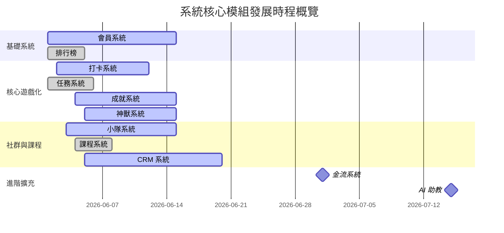

# 《NLP人性溝通術課程計分系統》專案路徑圖 (PROJECT_ROADMAP.md)

本文件根據當前系統的實作進度，梳理出 11 大核心系統模組的狀態，分為 **[已完成]**、**[進行中]** 與 **[未來規劃]**，以利專案後續開發與功能迭代的排程。

---

## 🗺️ 系統模組開發狀態總覽

---

## 📂 各系統分類詳情

### 1. 會員系統 (Member System)
*   **[已完成]**
    *   帳號密碼註冊與登入介面（`LoginForm`, `RegisterForm`）。
    *   基本使用者角色權限控制，支援管理員（`admin`）、小隊長（`captain`）、學員（`student`）三種身份與權限矩陣。
    *   學生個人修為值、當前等級與個人基本資料檔案。
    *   GM 測試模式（大會中樞切換身分功能），方便開發者快速模擬不同身份進行測試。
*   **[進行中]**
    *   無（功能已穩定運作）。
*   **[未來規劃]**
    *   整合第三方快速登入（例如 LINE 登入、Google OAuth），簡化現場學員註冊難度。
    *   自訂個人頭像與等級外框裝飾系統，強化個人化辨識度。

---

### 2. 任務系統 (Task System)
*   **[已完成]**
    *   任務中心分頁（`WeeklyTopicTab` / `WitnessTab`），顯示每週主線任務。
    *   學員提交任務證明機制，支援填寫心得文字、上傳佐證圖片及貼上社群分享連結。
    *   後台雙向審核中心（`AdminDashboard` 審核面板），管理員可對學員提交的證明進行「核准（發放修為值）」與「退回修正」。
    *   任務對象分流設定，可發布給全體、指定小隊或特定學員個人。
*   **[進行中]**
    *   無（核心功能已完整）。
*   **[未來規劃]**
    *   任務範本庫（Mission Template）功能，管理員能快速套用歷屆常用任務。
    *   AI 輔助證明審查，自動檢測網址連結有效性與圖片相似度。

---

### 3. 打卡系統 (Check-in System)
*   **[已完成]**
    *   修行定課打卡介面（`DailyQuestsTab`），學員可檢視今日打坐、日行一善等定課並進行一鍵快速簽到。
    *   自動加分與手動審核分流（免審核任務打卡後直接加分，需審核任務進入待審狀態）。
    *   限時任務倒數計時器與截止鎖定狀態。
*   **[進行中]**
    *   連續打卡（Streak）天數統計與「修行火苗」視覺特效。
*   **[未來規劃]**
    *   日曆打卡補簽功能。
    *   GPS/WiFi 地理定位打卡（配合線下實體課程）。

---

### 4. 小隊系統 (Team System)
*   **[已完成]**
    *   首頁 Header 小隊資訊顯示，小隊命名格式優化（隱藏重複期數前綴，顯示 `預設隊名 (自訂隊名)`）。
    *   指揮所小隊長後台（`CaptainDashboard`），提供直觀的「小隊打卡完成度矩陣」表格，小隊長能一鍵篩選出未完成打卡的組員。
    *   小隊長與組員的輔導備註紀錄（`student_notes`），具備嚴格的 RLS 安全防護（僅限自己小隊長與管理員查看）。
*   **[進行中]**
    *   後台拖拽式小隊成員分配器（Drag & Drop Team Builder），使管理員能在後台一鍵拖拉分配學員與指派小隊長。
*   **[未來規劃]**
    *   小隊專屬對抗挑戰賽與「團隊加成效果」。
    *   小隊內部即時聊天室與互動貼圖功能。

---

### 5. 課程系統 (Course System)
*   **[已完成]**
    *   學生端課程報名卡片與「前往課程報名連結」按鈕。
    *   報名連結預設網址防護（預設 `https://example.com/register-nlp` 確保版面體驗一致）。
    *   後台發布課程與日期管理，並提供已發布課程列表與一鍵垃圾桶刪除。
    *   學員端簽到 QR Code 產生器與小隊長/志工專屬的驗證掃碼簽到功能。
*   **[進行中]**
    *   無（核心功能已完整）。
*   **[未來規劃]**
    *   實體課堂自動簽到與遲到/缺席自動化流水帳。
    *   課程講義下載與線上錄影回放模組。

---

### 6. 神獸系統 (Pet/Divine Beast System)
*   **[已完成]**
    *   個人攜帶神獸的基本狀態，且修為分數自動對齊神獸經驗值（EXP）與等級。
*   **[進行中]**
    *   四條進化路線（尊者龍、卓越獅、親和狐、沉靜水母）的解鎖與自動進化機制。
    *   後台神獸各階段外觀、數值與描述的編輯器（`PetManager`）。
    *   圖片上傳背景透明度偵測（透明背景防護警示），確保圖片在雙主題模式下的視覺美感。
    *   學員端每日定課介面的神獸動態對話氣泡（Dialogue Bubble）與進化動畫效果。
*   **[未來規劃]**
    *   神獸餵食培育系統（使用打卡獲得的虛擬飼料）。
    *   神獸專屬裝扮與配件系統。
    *   神獸技能加成（例如攜帶親和狐時，寫見證分享分數加成 10%）。

---

### 7. 成就系統 (Achievement System)
*   **[已完成]**
    *   成就徽章牆介面，已解鎖展示彩色，未解鎖展示灰色並提示門檻（如：總修為達到 10,000）。
    *   資料庫 Trigger 自動解鎖機制：當 profiles 表中 score 更新並達標時，自動寫入 `user_achievements`。
*   **[進行中]**
    *   多維度成就判斷條件擴充（除了總修為外，新增打卡次數、課程出席次數等判斷依據）。
*   **[未來規劃]**
    *   成就稱號配戴系統，可將解鎖的特殊稱號顯示於 Header 個人頭像旁。
    *   隱藏成就與彩蛋任務。

---

### 8. 排行榜 (Leaderboard)
*   **[已完成]**
    *   個人修為排行榜：展示全體學員的名次、頭像、姓名與總分。
    *   小隊排行榜：以小隊平均分（總分 / 小隊人數）進行排行，確保組員人數不同的公平性。
*   **[進行中]**
    *   無（核心功能已完成）。
*   **[未來規劃]**
    *   動態排行榜：新增「週排行榜」與「月排行榜」，讓後進學員亦有機會爭奪榜首。
    *   排行榜前三名登入時的全域公告特效。

---

### 9. CRM (Customer Relationship Management / 學員關係管理)
*   **[已完成]**
    *   小隊長與管理員雙向學員備註記錄。
*   **[進行中]**
    *   學員出席與打卡健康度監控（整合小隊出席率熱力圖與未完成名單統計）。
*   **[未來規劃]**
    *   學員中途放棄/低參與度預警系統：當學員連續 3 天未打卡且未出席時，自動發出提醒通知小隊長進行關懷。
    *   歷屆學員成長軌跡追蹤與輔導歷史報表匯出。

---

### 10. 金流 (Payment Flow)
*   **[已完成]**
    *   無。
*   **[進行中]**
    *   無。
*   **[未來規劃]**
    *   線上課程直接報名與第三方金流串接（如藍新、綠界科技等金流平台）。
    *   付費購買實體大會講義、工作坊票券，或兌換 NLP 相關周邊實體商品。

---

### 11. AI助教 (AI Assistant)
*   **[已完成]**
    *   無。
*   **[進行中]**
    *   無。
*   **[未來規劃]**
    *   **AI 心得點評與回饋**：整合大型語言模型（LLM），自動針對學員提交的「每日定課心得」與「每週主線證明」進行 NLP 理論點評與心理引導鼓勵，大幅減輕助教審核的心力。
    *   **NLP 練習對話機器人**：提供學員在線上練習「建立親和感」、「設定心錨」與「拆解限制性信念」的 AI 對話模擬場景。
    *   **小隊長 AI 輔導建议助理**：根據小隊長填寫的組員輔導備註，自動提供符合 NLP 親和與引導技術的個別化輔導對話大綱建議。
