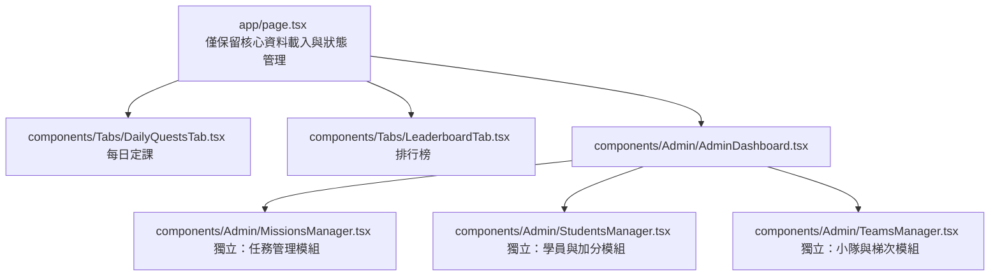

# 《NLP人性溝通術系統》安全性升級與架構優化完整建議書

本建議書針對當前系統架構進行深度診斷，彙整了目前系統面臨的**安全漏洞、效能瓶頸與架構重構方案**。由於您已將 **Supabase 升級為付費版（Pro Tier）**，本建議書已特別針對付費版解鎖的官方備份、無痛簡訊驗證與高硬體規格進行了對應的規劃。

---

## 📋 系統現狀診斷：四大核心風險與成因

| 風險級別 | 瓶頸與風險項目 | 具體影響 | 根本原因 |
| :---: | :--- | :--- | :--- |
| 🔴 **最高** | **資料庫對所有人完全開放（RLS 全開）** | 任何懂開發者工具的人，可用公開 anon key 直接讀寫、竄改任何分數、更改他人資料、甚至清空資料庫。 | 系統目前無真實「帳號驗證」，皆以匿名 (anon) 使用者連線，資料庫分不出是誰，被迫開啟 `USING (true)`。 |
| 🟡 **中等** | **網頁載入時偷偷執行資料庫寫入** | 多個學員在同一秒開啟網頁時，會產生寫入衝突（Concurrency Collision）或重複的任務資料。 | 前端在載入時自動計算學員等級，若發現達 Lv.5 就現場調用 API 插入進化任務，與前端載入過程高度耦合。 |
| 🟡 **中等** | **Client 端 $O(N^2)$ 雙迴圈關聯聯立** | 資料筆數一旦突破千筆，瀏覽器在做打卡與個資比對時會產生明顯卡頓與掉幀。 | 在 JavaScript 程式碼中，重複對列表進行遍歷 `.find()` 與 `.filter()`，造成運算複雜度過高。 |
| 🟡 **中等** | **載入失敗時無提示（直接顯示白畫面）** | 遇到 Supabase 瞬間不穩定或網路不良時，學員會卡在空白頁面，容易造成客服客訴。 | `fetchData` 拋出錯誤時僅 console.error 記錄，未設置錯誤狀態，導致 React 渲染空白狀態。 |

---

## ⚡ 遊戲化經驗值（EXP）設計與調整原因

1.  **調整升級門檻為 700 EXP（已實作）**
    *   *原因*：防止後期因「推薦初階 (+1500 EXP)」、「次感元個案 (+1000 EXP)」等大額任務審核通過後，學員等級瞬間跳級（例如直接連跳 3 級），導致神獸 Level 25 的終極型態失去稀有度。
2.  **雙軌天數加速預估與「時間折抵」機制（已實作）**
    *   *原因*：若單純以日常定課速度計算，3500 EXP 破殼需要 24 天，這會讓新學員覺得目標太過漫長而失去信心。改為「積極挑戰最快 5 天破殼，認真修行也僅需 12 天」，並在攻略內亮點標示「完成任務可幫破殼時間減免 X 天」，利用蔡加尼克效應與目標趨近效應激發學員主動挑戰高難度推廣任務。

---

## 💎 付費版 Supabase 解鎖之 v2 升級藍圖

升級為付費版後，資料庫效能得到極大保障。我們建議排在兩期課程中間的空檔，進行安全性與帳號系統的全面重構。

### 1. 簡訊 OTP 認證流程（學員體驗最佳）
學員不需設定與記住密碼，只需輸入手機號碼，即可一鍵完成登入：
```
學員網頁 ➔ 輸入手機 ➔ 呼叫 supabase.auth.signInWithOtp() ➔ 簡訊發送驗證碼
  ➔ 輸入驗證碼 ➔ 呼叫 supabase.auth.verifyOtp() ➔ 驗證通過並建立 Session
```

### 2. 資料庫權限（RLS）安全收緊設計
我們必須關閉 `USING (true)`，並重新鎖緊權限原則，確保資料不被惡意竄改：
*   **public.profiles (學員帳號表)**：
    *   `SELECT`：允許本人（`auth.uid() = auth_user_id`）或管理員讀取。
    *   `UPDATE`：僅限本人修改手機與暱稱；**分數與等級由資料庫 Trigger 自動增減，前端不允許直接寫入**。
*   **public.submissions (打卡表)**：
    *   `INSERT`：僅限本人新增自己的打卡。
    *   `UPDATE`：僅限小隊長/大隊長更新審核狀態（`status = 'approved'`）。

---

## 🤝 模組化拆分重構與雙人協同開發時程

為了避免前端組件（目前 `page.tsx` 超過 2800 行）過度臃腫，我們規劃將管理功能解耦，並由 AI 與您進行雙人協同開發：



### 📅 開發時程預估（雙人合作可將時程縮短 70%）

*   **第 1 天：後台模組化拆分與瘦身**（AI 產出 Props 介面與組件代碼，您在本地進行 Next.js 編譯確認）。
*   **第 2 天：簡訊驗證 OTP 登入對接**（AI 撰寫 Auth API 對接邏輯，您在 Supabase console 開啟簡訊服務並進行登入測試）。
*   **第 3 天：資料庫 RLS 鎖定與安全測試**（AI 撰寫安全性 DDL 腳本，您執行 SQL 並確認學員端無法自行修改分數）。

---

## 🟢 上線日前夕維運檢查清單 (不用改程式)

1.  **自動備份確認**：至 Supabase 後台確認已啟用 Daily Backups。
2.  **Storage 公開讀取**：確認 `proof-images` Bucket 權限為 Public，保證正式網址能正常讀取學員上傳的打卡相片。
3.  **Vercel 環境變數**：雙重確認 Vercel 環境中的 Supabase URL 與 Anon Key 是指向正式的付費版專案，而非測試用的舊專案。
