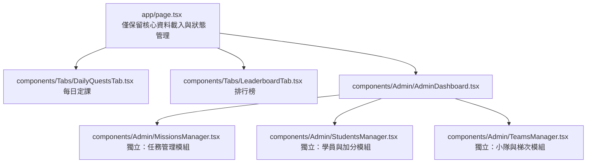

# 《NLP人性溝通術系統 v2》安全權限收緊與架構重構完整規劃書

本規劃書旨在針對現有系統（v1）的**資料庫安全漏洞（RLS 全開）**、**系統強健度弱點（載入失敗白畫面、開網頁寫資料庫）**與**程式碼體積龐大**等問題，進行深度成因剖析，並規劃出 v2 安全性升級與架構重構的具體施工藍圖。

---

## 🔴 核心風險：資料庫對所有人完全開放（RLS 全開）

### 1. 成因剖析（為什麼會這樣？）
目前系統在使用者登入時，是採用「學員輸入姓名與手機」進行資料庫查表。這只是一種「模擬查詢」，**並不是真正的身分驗證**。
*   由於沒有經過 Supabase Auth（身分令牌認證），所有的資料庫讀寫請求在 Supabase 核心中，都只被視為同一種人：`anon`（匿名公共使用者）。
*   因為資料庫分不出前端請求的真實身分，為了讓每位學員能正常提交打卡、讀取資料，系統只能在 `schema.sql` 中把 RLS（行級安全政策）設為 `USING (true)`，即**「允許所有人對所有表進行任意讀寫」**。

### 2. 潛在風險
*   **數據竄改**：任何學員只要打開瀏覽器開發者工具（F12），複製網頁中公開的 `anon key`，即可透過 REST API 發送請求改動任何欄位。例如：將自己的分數 `score` 直接改成 99999、手動變更自己的寵物等級、或者擅自通過自己的審核。
*   **隱私外洩**：匿名使用者可以輕易拉取 `profiles` 表中所有學員的姓名、手機號碼等敏感個資。
*   **惡意刪除**：未限制寫入權限，代表惡意請求可以直接清空 `submissions`、`score_logs` 等核心表。

### 3. v2 安全防禦方案
我們需要引進 **Supabase Auth（真實身分驗證）**，將「匿名查表」升級為「權限管控機制」：
```
學員輸入手機 ➔ 接收簡訊驗證碼 (OTP) ➔ 通過 Supabase Auth ➔ 取得 JWT 身分權限令牌 ➔ 資料庫依令牌進行 RLS 行級校驗
```

*   **實作步驟**：
    1.  **啟用手機 OTP / 密碼登入**：在 Supabase 控制台開啟 Phone Auth 登入介面。
    2.  **綁定用戶身分**：在 `profiles` 中加入欄位 `auth_user_id (UUID)`，將報名個資與 Supabase 帳號綁定。
    3.  **建立權限角色表 `user_roles`**：將 `admin` 與 `captain` 的身分在資料庫端鎖死，避免前端偽造權限。
    4.  **收緊 RLS 政策**：
        ```sql
        -- 以 submissions（打卡紀錄）表為例：
        -- 1. 僅允許本人新增自己的打卡
        CREATE POLICY "Insert own submission" ON public.submissions
          FOR INSERT TO authenticated WITH CHECK (auth.uid() = auth_user_id);
        
        -- 2. 僅限本人、同小隊長、大隊長可以讀取
        CREATE POLICY "Select allowed submissions" ON public.submissions
          FOR SELECT TO authenticated USING (
            auth.uid() = auth_user_id 
            OR is_captain_of_squad(auth.uid(), student_id)
            OR is_admin(auth.uid())
          );
        ```

---

## 🟡 核心風險：載入失敗時「白畫面」無提示

### 1. 成因剖析
在當前程式碼 [page.tsx](file:///Users/leo/Desktop/定課系統/NLP_GAME/app/page.tsx) 的 `fetchData` 函數中：
```typescript
try {
  const { data } = await supabase.from('...').select('*');
  // ...
} catch (error) {
  console.error("載入失敗：", error);
  // 僅印出 console.log，未設置錯誤狀態，返回空值
}
```
*   當免費版 Supabase 專案因一段時間未使用進入休眠、網路瞬間斷線、或是 API 限制時，`fetchData` 拋出錯誤並中斷執行。
*   此時，React 狀態（如 `profiles`、`userPets`）皆維持初始的空值。前端沒有對此異常進行防禦，導致學員只會看到一個**「全白無內容的頁面」**或**「無限載入動畫」**，體驗極差。

### 2. 解決方案（白畫面防禦）
新增錯誤狀態，並在載入失敗時渲染精緻的錯誤提示頁與重試按鈕：
```tsx
const [loadError, setLoadError] = useState<string | null>(null);

const fetchData = async () => {
  try {
    setLoadError(null);
    // 執行 supabase 查詢...
  } catch (error) {
    setLoadError("伺服器連線異常，請檢查網路或稍後重試。");
  }
};

// 渲染防禦：
if (loadError) {
  return (
    <div className="flex flex-col items-center justify-center min-h-screen text-center p-6 bg-[#03000a] text-white">
      <div className="glass-panel p-8 rounded-3xl border border-red-500/20 max-w-sm space-y-4">
        <div className="text-red-500 text-4xl">⚠️</div>
        <h3 className="font-bold text-lg">系統載入中斷</h3>
        <p className="text-xs text-slate-400 leading-relaxed">{loadError}</p>
        <button onClick={fetchData} className="px-5 py-2.5 bg-purple-600 hover:bg-purple-500 rounded-xl text-xs font-bold transition-all">
          重新整理試試 ➔
        </button>
      </div>
    </div>
  );
}
```

---

## 🟡 核心風險：頁面載入時偷偷寫入資料庫

### 1. 成因剖析
目前在 [page.tsx](file:///Users/leo/Desktop/定課系統/NLP_GAME/app/page.tsx) 約第 480~500 行的讀取邏輯中：
*   每次有任何使用者（包括管理員或普通學員）開啟網頁、執行 `fetchData` 時，程式會在前端掃描所有學員。
*   如果發現某個學員達到了 Level 5（進化門檻），且資料庫還沒有對應的進化任務，前端就會**當場私下調用 Supabase API 向 `user_pets` 寫入一筆新寵物紀錄，或向 `missions` 寫入任務**。

### 2. 潛在風險
*   **併發衝突與重複寫入**：若兩個使用者在同一秒鐘打開網頁，兩個瀏覽器會同時偵測到學員達 Lv5，並在同一瞬間對資料庫執行 `INSERT`，引發資料庫寫入衝突或產生重複的任務列。
*   **防禦性極差**：前端不應該擁有這種「自動背景全域計算」的寫入權限。這會導致資料庫狀態非常難以預測與追蹤。

### 3. 解決方案
*   **改為「後端觸發」或「按鈕點擊寫入」**：
    *   取消全域 `fetchData` 時的自動偵測與寫入。
    *   改為：只有在學員點擊「開啟進化考驗`」時，由該學員的前端主動呼叫 `INSERT` 自己的寵物或任務。
    *   或者：寫入資料庫的邏輯完全改用 Postgres Function (Trigger) 來自動處理，徹底與前端載入解耦。

---

## 🤝 雙人協同開發重構計畫

為了在短時間內將系統優化至「工業級安全性」與「模組化架構」，我們將合作進行重構：

### 1. 職責劃分
*   **Antigravity (AI)**：負責大檔案分割、Props TypeScript 介面編寫、Supabase 複雜 RLS SQL 指令生成、資料庫 Trigger 封裝、排錯與重構代碼。
*   **使用者 (USER)**：負責在本地運行、確認功能是否正常、將 SQL 貼入 Supabase 執行、代碼審查與測試。

### 2. 模組化拆分藍圖：瘦身大組件
目前 [page.tsx](file:///Users/leo/Desktop/定課系統/NLP_GAME/app/page.tsx) 程式碼高達 2800 多行，且管理員後台 [AdminDashboard.tsx](file:///Users/leo/Desktop/定課系統/NLP_GAME/components/Admin/AdminDashboard.tsx) 也相當臃腫。我們將進行以下拆分：



### 3. 實作時程表 (雙人協同估計：2-3 天即可完工)

*   **第一天：組件架構拆分與瘦身 (4小時)**
    *   AI 進行 `AdminDashboard` 拆分，輸出 `MissionsManager`、`StudentsManager`、`TeamsManager`。
    *   處理好所有 TypeScript Props 的定義。
    *   使用者在本地確認 Next.js 編譯通過。
*   **第二天：Auth 帳號系統對接與前端登入修改 (4小時)**
    *   AI 提供 Auth 註冊登入代碼、開機 Session 讀取。
    *   使用者開啟 Supabase Auth 服務，並在本地運行測試登入。
*   **第三天：資料庫 RLS 收緊與加分 RPC 鎖定 (4小時)**
    *   AI 寫出收緊後的 DDL 與 RLS 政策 SQL。
    *   使用者貼入 Supabase 執行，雙方協同完成最後的權限與邊界功能測試（學員是否無法改分、隊長是否正常審核）。
