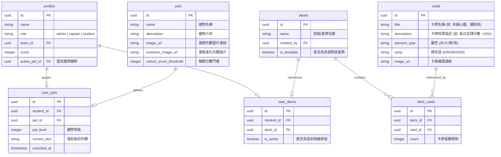

# NLP 人性溝通術計分系統 - 遊戲化管理者後台設計規劃書

本規劃書旨在為「NLP人性溝通術課程計分系統」規劃一個功能完善、遊戲感十足且極具視覺美感的**管理者總控制後台 (Admin Dashboard)**。後台除整合現有的每日定課、審核功能外，將擴充**任務參數化配置**、**寵物外觀培育**、**卡牌排組 (Deck)** 及**小隊成員權限調配**四大模組。

---

## 1. 系統架構與資料庫擴充設計 (Database Schema Expansion)

為支援「寵物系統」與「卡牌排組系統」，我們需要在原有資料庫的基礎上進行以下資料表擴充：

---

## 2. 後台五大核心模組設計規劃

### 模組一：多維任務發布與參數設定 (Quests & Parameters Config)
管理者可在此發布所有類型的修行任務，並細緻調整各類遊戲化參數。

*   **界面設計要點**：
    *   **任務類型篩選器**：提供「每日定課 (Daily)」、「每週主線 (Weekly)」、「活動特殊 (Temporary)」與「限時挑戰 (Limited-Time)」快速切換標籤。
    *   **參數配置表單**：
        *   `基本資訊`：任務名稱、任務背景故事（增加代入感）、詳細實行指標。
        *   `分值參數`：完成基礎修為獎勵（Score）、額外暴擊獎勵機率。
        *   `審核參數`：
            *   *自動通關*（適合免證明的打坐、感恩等）。
            *   *人工審核*（需上傳文字、連結或圖片截圖）。
        *   `時間參數`：限時任務的「倒數計時器」，支援精確到分鐘的開始與截止時間（截止後學員端自動隱藏）。
        *   `對象參數`：發布給全體、特定小隊（例如第一組專屬任務）或特定學員個人（針對特別表現的個人挑戰）。

---

### 模組二：寵物外觀與培育系統 (Pet Evolution & Customization)
透過寵物系統，將學員的修為分數具象化為「寵物成長值」，增加學習黏著度。

*   **界面設計要點**：
    *   **寵物圖鑑管理器**：
        *   上傳寵物在不同階段的插畫（孵化期蛋 ➡️ 幼體 ➡️ 成熟期 ➡️ 終極進化體）。
        *   設定解鎖該外觀所需的「修為分數」或「任務條件」。
    *   **外觀與裝扮上架區**：
        *   管理者可上架限時活動獲得的寵物特殊裝扮（例如：慶典頭飾、修行披風的圖片 URL）。
        *   設定該外觀的權限，可手動分發給傑出小隊長或學員作為實體榮譽。
    *   **學員寵物狀態總覽**：
        *   列表展示全班學員的寵物名稱、等級、攜帶外觀、目前心情值，支援管理員一鍵對特定學員的寵物發放「活力飼料」或調整等級。

---

### 模組三：雙向審核中心 (Submissions Audit Center)
處理學員日常提交的文字心得、自媒體連結與圖片佐證，提供流暢的審核工作流。

*   **界面設計要點**：
    *   **分欄工作面板**：
        *   *左側*：待審核清單（標記提交時間、學員姓名、小隊名稱、所屬任務）。
        *   *右側*：詳細審核視窗。點選清單後直接在右側加載證明文字、超連結（支援一鍵跳轉）與**圖片預覽（支援點擊放大與旋轉）**。
    *   **一鍵快速決策按鈕**：
        *   `同意加分 (綠色)`：發放任務修為，觸發學員端灑花與修為浮空動畫。
        *   `退回修正 (黃色)`：彈出原因快捷選單（如：圖片不符、心得字數不足、連結失效），點選後自動退回並給學員發送通知。
    *   **審核歷史流水帳**：可查詢所有已審核紀錄、修改審核狀態，並支援依審核人（助教/大隊長）進行績效篩選。

---

### 模組四：卡牌排組管理 (Card & Deck Setup)
為計分系統注入策略卡牌元素，學員可以利用完成定課獲得的卡牌組合為「排組」，藉此在特定任務中獲得被動加成。

*   **界面設計要點**：
    *   **卡牌資料庫編輯器**：
        *   創建卡牌：設定卡牌名稱、卡面美術（上傳精美插圖）、稀有度（SSR / SR / R / N 炫彩框線設計）。
        *   設定**卡牌效果參數**：
            *   *「水屬性：定課加成」* ➡️ 當裝備此卡，每日定課修為加成 10%。
            *   *「火屬性：助人為樂」* ➡️ 幫助組員打卡時，自己額外獲得 50 修為。
            *   *「風屬性：神速打卡」* ➡️ 每日 09:00 前完成打卡，分數加倍。
    *   **系統預設排組 (Deck Template) 配置**：
        *   管理員可調配 3~5 套基礎排組模板（例如：日常修行套牌、限時衝刺套牌）。
        *   分配給小隊長或學員，用作課程初期的一鍵套用。

---

### 模組五：小隊長與組員權限調配 (Teams & Roster Configuration)
核心的人事管理中樞，可指派小隊長、分配組員，並監控小隊整體修為。

*   **界面設計要點**：
    *   **可拖拽小隊分配器 (Drag & Drop Team Builder)**：
        *   左側為「未分配小隊成員」，右側為「各小隊容器」（內含小隊名稱、小隊長欄位、組員列表）。
        *   管理員可直接將未分配學員拖拽拉入小隊，或將組員設為「小隊長」。
    *   **身分權限矩陣切換**：
        *   可手動調整特定用戶為 `admin` (大隊長/助教)、`captain` (小隊長/導師)、`student` (一般學員)。
    *   **輔導備註與小隊健康度監控**：
        *   展示小隊的「平均分數」與「出席率熱力圖」。
        *   整合小隊長填寫的「學員輔導備註」摘要，管理者可隨時新增大隊長批註，以利在線下實體課中給予特定學員關懷與輔導。

---

## 3. 前端 UI 設計美感規範 (Premium UI/UX Design System)

為了帶給使用者極致的科技感與遊戲代入感，管理後台的 UI 界面應遵循以下設計規範：

*   **色彩計畫 (Theme Colors)**：
    *   **深色背景**：極深藍灰色（`#020617` Slate-950）搭配半透明玻璃質感面板（Glassmorphism）。
    *   **強調色 (Accent Colors)**：
        *   管理權限：珊瑚紅（`#ef4444` Red-500）
        *   金幣與修為：琥珀金（`#f59e0b` Amber-500）
        *   成功/審核通過：翡翠綠（`#10b981` Emerald-500）
        *   特殊/限時任務：極光紫（`#a855f7` Purple-500）
*   **字型與字重**：使用 `Inter` 或 `Outfit` 字型，標題使用極粗字重（Font-black 900），強調現代極簡風。
*   **動態微交互 (Micro-Animations)**：
    *   審核按鈕懸停時具備發光特效（Glow effect）。
    *   任務列表拖拽時帶有彈性物理動畫（Spring physics）。
    *   寵物狀態頁面可有呼吸起伏的微動畫。

---

## 4. 線上部署與實施指南 (Next Steps)

若要著手開發此後台，建議按照以下路徑推進：
1.  **資料庫遷移 (Migration)**：直接執行第一節中所列的 PostgreSQL SQL 擴充指令，將 `pets`、`cards`、`decks` 等資料表部署至 Supabase。
2.  **API 開發**：於 `lib/supabase.ts` 中新增對應的 Mock 與 Real Supabase 接口函數。
3.  **UI 組件開發**：於 `components/Admin` 下，將 `AdminDashboard.tsx` 進行子分頁擴充（依序新增 `PetManagerTab`、`DeckManagerTab`、`TeamManagerTab`）。
