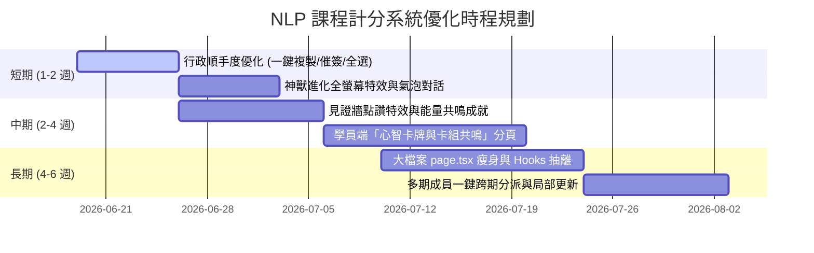

# NLP 課程計分系統 — 全方位功能優化建議書 (2026 最新版)

本建議書基於目前 NLP 課程計分系統的架構設計、已完成的成就與排行榜功能、以及資料庫中未充分利用的卡牌與社交欄位，針對**學員端遊戲化體驗**、**後台管理順手度**與**系統底層健康度**提出五大高價值的後續優化方案。

---

## 📌 優化方案一：啟用學員端「心智卡牌與卡組共鳴」分頁 (Cards & Decks)
> [!TIP]
> **當前痛點**：目前資料庫中已建置了卡牌（`Card`：包含水、火、風、地四種元素與 N/R/SR/SSR 稀有度）與卡組（`UserDeck`、`DeckCard`）的完整資料模型，且後台具備管理面板，但**學員前端頁面尚未有任何介面可供瀏覽、收集或管理卡牌**。

### 🛠️ 具體方案
1. **新增「心智卡庫」分頁**：開放學員收集卡牌。學員可透過每日定課完美達標、解鎖金色徽章或連續修行打卡時獲得隨機抽卡包。
2. **實作「卡組共鳴與修行加成（Synergy Buffs）」機制**：
   允許學員編輯自己的啟動卡組（Active Deck）。當卡組中同屬性的卡牌達到特定數量時，觸發**屬性共鳴**。例如：
   * **🔥 火屬性共鳴（3張）**：學員每日定課完成時獲得的修行分數（EXP）額外加成 10%。
   * **💧 水屬性共鳴（3張）**：神獸修行進化所需的總經驗值降低 15%。
   * **💨 風屬性共鳴（3張）**：連續修行打卡中斷時，提供一次「免斷保護」機會，自動消耗該效果。
   * **🪨 地屬性共鳴（3張）**：當因特殊原因被管理員扣分時，自動減免 50% 的扣分額度。
3. **閉環效應**：將打卡活動、神獸進化與卡牌系統完美串聯，大幅提高學員每日定課的黏著度與趣味性。

---

## 📌 優化方案二：見證牆社交化與「能量共鳴」成就解鎖 (Social & Resonance)
> [!IMPORTANT]
> **當前痛點**：目前的見證牆 [WitnessTab.tsx](file:///Users/leo/Desktop/定課系統/NLP_GAME/components/Tabs/WitnessTab.tsx) 雖已具備基本的按讚與留言資料結構，但尚未與**成就系統**深度整合，缺乏能激勵學員撰寫高質量分享的誘因。

### 🛠️ 具體方案
1. **點讚/送能量微型特效**：學員點擊「給予能量（按讚）」時，觸發微型心形噴發或能量波紋 CSS 動態特效，提升操作的視覺回饋。
2. **新增「能量共鳴」成就解鎖條件**：
   在 Supabase 成就解鎖的核心函數 `_check_unlock_achievements` 中，新增對**被點讚數（`witness_likes_received`）**的判斷。當學員的心得日記累計獲得 10、30、50 次同儕能量點讚時，系統自動解鎖專屬的金色隱藏徽章（如：`共振之光`、`靈魂共鳴者`、`修行大導師`）。
3. **社群氛圍活化**：這將激勵學員分享更有深度、更能引發同修共鳴的修行日記，形成正向循環的學習社群氛圍。

---

## 📌 優化方案三：神獸系統遊戲感「活化」與視覺互動 (Interactive Pet)
> [!TIP]
> **當前痛點**：神獸進化目前僅是靜態的分頁顯示，屬性成長對學員來說感受不明顯，缺乏神獸與學員之間的「情感連結」。

### 🛠️ 具體方案
1. **全螢幕進化特效 (Confetti & Card Flip)**：神獸達到進化門檻時，學員點擊進化後，播放全螢幕五彩碎紙（Confetti）並伴隨神獸卡片翻轉發光的 3D 動畫。
2. **點擊對話氣泡**：學員點擊神獸圖片時，神獸會彈出隨機對話氣泡（如：「今天也有好好轉念嗎？」、「主人，我感覺快要進化了！」、「水元素能讓我變聰明喔！」），對話內容可依神獸的元素屬性（水、火、風、地）進行動態客製。
3. **四維屬性成長條優化**：將原本需要極高分數（如 3 萬分）才能填滿的四維屬性（能量、智慧、愛心、意志），調整為更平滑且具階段性（如每 1000 分為一個小節點）的進度條，讓學員的進步每天都清晰可見。

---

## 📌 優化方案四：多期報名與後台行政流程「防呆與順手度」 (Usability)
> [!NOTE]
> **當前痛點**：目前在管理跨期成員時，大隊長與小隊長的操作步驟較繁瑣。此外，邀請連結無法一鍵複製、數字輸入框在輸入時預設 0 的問題容易造成輸入摩擦。

### 🛠️ 具體方案
1. **歷屆學員一鍵跨期指派**：在大隊長後台的小隊名冊管理中，新增「從歷屆成員一鍵指派至此梯次」的功能，直接在資料庫中為該成員 `insert` 新一期的 `profiles` 並初始化新神獸，學員免於重新註冊。
2. **前台期別/身分切換器**：在頂部導覽列提供顯著的「期數下拉切換器」，若學員同時身兼「A 期小隊長」與「B 期學員」，能一鍵切換視角，查看各自對應的每日任務、神獸進度與排行榜。
3. **後台「未打卡名單」催簽工具**：後台新增當日「未打卡學員總覽」，並提供「一鍵複製催簽訊息」按鈕，自動產生艾特（@）未打卡學員的名單（如：「@張三 @李四，今天尚未完成打卡，別忘了來修行喔！」），方便組長在 LINE 群催簽。
4. **邀請連結一鍵複製**：後台邀請碼區域增加「複製完整邀請網址」按鈕，直接拼接包含 `cohort_id` 與 `squad_id` 的註冊網址，防範大隊長手動拼接出錯。

---

## 📌 優化方案五：系統底層重構與維護性提升 (Code Cleanup & Performance)
> [!IMPORTANT]
> **當前痛點**：主要入口 [page.tsx](file:///Users/leo/Desktop/定課系統/NLP_GAME/app/page.tsx) 程式碼行數已達 3,100 行以上，混合了太多業務邏輯與狀態（50+ 個 `useState`）。此外，每次操作都重新載入全部 25 張表，隨資料增加會造成 Supabase 免費版效能瓶頸。

### 🛠️ 具體方案
1. **業務邏輯解耦 (React Hooks)**：參考 [維護性重構-計畫書.md](file:///Users/leo/Desktop/定課系統/NLP_GAME/docs/維護性重構-計畫書.md) 的規劃，將狀態與處理函式依照領域抽離成**自訂 React Hooks**（如：`useAuth`、`useStudentActions`、`usePetActions`、`useReview`、`useAdminContent` 等），讓 `page.tsx` 回歸到僅負責頁面組裝的 800 行以內結構。
2. **引入局部更新與快取機制 (Zustand / SWR)**：
   * 導入輕量狀態管理 **Zustand**，消除層層傳遞 state 參數的麻煩。
   * 將每次操作後都「整包 re-fetch 25 張表」的邏輯，優化為「局部狀態更新（Optimistic Updates）」，並將資料載入範圍限制在目前期別（`batch_id`），防止資料庫壓力過大，確保免費版資料庫依然能秒速回應。

---

## 📈 實施優先級建議 (Roadmap)

根據開發難易度與學員體感價值，建議分三期推進：

### 🥇 第一階段：短期（立即提升順手度與遊戲氛圍，約 1-2 週）
* **行政端**：一鍵複製邀請連結、數字輸入框全選優化、未打卡一鍵催簽名單。
* **學員端**：神獸點擊隨機對話氣泡、神獸進化全螢幕 Confetti 灑花特效。
* **效果**：幾乎無資料庫結構調整風險，能大幅降低行政客服量，並讓學員立刻感受到神獸系統的生命力。

### 🥈 第二階段：中期（啟用核心遊戲化卡牌，約 2-4 週）
* **學員端**：新增「心智卡牌」分頁、抽卡包介面、卡組編輯器。
* **規則層**：開發四屬性（火、水、風、地）的共鳴加成邏輯。
* **社交層**：點讚微特效、串接見證點讚解鎖特殊成就。
* **效果**：正式啟動卡牌閉環，讓打卡、積分、進化、卡牌產生深度的化學反應，提升長線打卡率。

### 🥉 第三階段：長期（重構底層健壯度，約 4-6 週）
* **架構層**：瘦身 page.tsx、抽離 Custom Hooks、導入 Zustand 狀態管理。
* **後端與效能**：多期報名一鍵分派、限制 cohort fetch 範圍、落實局部 optimistic 更新。
* **效果**：大幅提升未來新增功能的擴充性與安全性，為系統在未來百人、千人同時在線打卡打下堅實的效能基礎。
